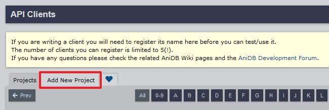
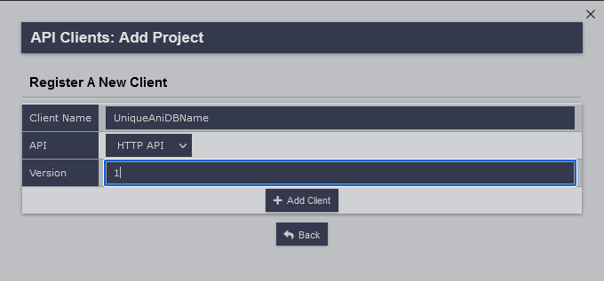

# AniDB Attributes

Configuring [AniDB](https://anidb.net/) is optional but can unlock more features from the site

Using `client` and `version` allows access to AniDB Library Operations.

Using `username` and `password` allows you to access mature content with AniDB Builders.

**All AniDB Builders still work without this, they will just not have mature content**

A `anidb` mapping is in the root of the config file.

Below is a `anidb` mapping example and the full set of attributes:
```yaml
anidb:
  client: #######
  version: 1
  language: en
  cache_expiration: 60
  username: ######
  password: ######
```

| Attribute          | Allowed Values                                                                                | Default | Required |
|:-------------------|:----------------------------------------------------------------------------------------------|:-------:|:--------:|
| `client`           | AniDB Client Name                                                                             |   N/A   | &#10060; |
| `version`          | AniDB Client Version                                                                          |   N/A   | &#10060; |
| `language`         | [ISO 639-1 Code](https://en.wikipedia.org/wiki/List_of_ISO_639-1_codes) of the User Language. |   en    | &#10060; |
| `cache_expiration` | Number of days before each cache mapping expires and has to be re-cached.                     |   60    | &#10060; |
| `username`         | AniDB Username                                                                                |   N/A   | &#10060; |
| `password`         | AniDB Password                                                                                |   N/A   | &#10060; |

* To get a Client Name and Client Version please follow the following steps.

1. Login to [AniDB](https://anidb.net/)
2. Go to you [API Client Page](https://anidb.net/software/add) and go to the `Add New Project` Tab.



3. Fill in the Project Name with whatever name you want and then hit `+ Add Project`. The rest of the settings don't matter.
4. After you've added the project you should end up on the Projects Page. If not go back to the [API Client Page](https://anidb.net/software/add) and click your projects name. 
5. Once you're on the project page click `Add Client` in the top right.


6. Come up with and enter a unique to AniDB Client Name, select `HTTP API` in the API Dropdown, and put `1` for Version.



7. Put the Client Name and Client Version you just created in your config.yml as `client` and `version` respectively.

```yaml
anidb:
  client: UniqueAniDBName
  version: 1
  language: en
  cache_expiration: 60
```