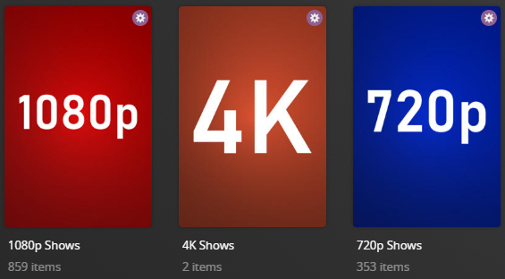

# Resolution Collections

The `resolution` Default Metadata File is used to dynamically create collections based on the resolutions available in your library.

To avoid duplication, this file should not be used in combination with [`resolution_standards`](resolution_standards).

**This file works with Movie and TV Libraries.**



## Collections Section 15

| Collection                                                   |                 Key                 | Description                                                |
|:-------------------------------------------------------------|:-----------------------------------:|:-----------------------------------------------------------|
| `Resolution Collections`                                     |             `separator`             | Separator Collection to denote the Section of Collections. |
| `<<Resolution>> Movies/Shows`<br>**Example:** `1080p Movies` | `<<Number>>`<br>**Example:** `1080` | Collection of Movies/Shows that have this Resolution.      |

## Config

The below YAML in your config.yml will create the collections:

```yaml
libraries:
  Movies:
    metadata_path:
      - pmm: resolution
  TV Shows:
    metadata_path:
      - pmm: resolution
```

## Template Variables

Template Variables can be used to manipulate the file in various ways to slightly change how it works without having to make your own local copy.

Note that the `templates_variables:` section only needs to be used if you do want to actually change how the defaults work. Any value not specified is its default value if it has one if not it's just ignored.

All [Shared Variables](../variables) are available as well as the additional Variables below which can be used to customize the file.

| Variable             | Description & Values                                                                                                                                                                                                                                                |
|:---------------------|:--------------------------------------------------------------------------------------------------------------------------------------------------------------------------------------------------------------------------------------------------------------------|
| `use_separator`      | **Description:** Turn the separator collection off.<br>**Values:** `false` to turn of the collection                                                                                                                                                                |
| `sep_style`          | **Description:** Separator Style.<br>**Default:** `orig`<br>**Values:** `orig`, `red`, `blue`, `green`, `gray`, `purple`, or `stb`                                                                                                                                  |
| `limit`              | **Description:** Changes the Builder Limit for all collections in a Defaults file.<br>**Values:** Number Greater then 0                                                                                                                                             |
| `limit_<<key>>`      | **Description:** Changes the Builder Limit of the specified key's Collection.<br>**Default:** `limit`<br>**Values:** Number Greater then 0                                                                                                                          |
| `sort_by`            | **Description:** Changes the Smart Filter Sort for all collections in a Defaults file.<br>**Default:** `release.desc`<br>**Values:** [Any `smart_filter` Sort Option](../../metadata/builders/smart.md#sort-options)                                                |
| `sort_by_<<key>>`    | **Description:** Changes the Smart Filter Sort of the specified key's Collection.<br>**Default:** `sort_by`<br>**Values:** [Any `smart_filter` Sort Option](../../metadata/builders/smart.md#sort-options)                                                          |
| `exclude`            | **Description:** Exclude these Resolutions from creating a Dynamic Collection.<br>**Values:** List of Resolutions found in your library                                                                                                                             |
| `addons`             | **Description:** Overrides the [default addons dictionary](#default-addons). Defines how multiple keys can be combined under a parent key. The parent key doesn't have to already exist in Plex<br>**Values:** Dictionary List of Resolutions found in your library |
| `append_addons`      | **Description:** Appends to the [default addons dictionary](#default-addons).<br>**Values:** Dictionary List of Resolutions found in your library                                                                                                                   |
| `resolution_name`    | **Description:** Changes the title format of the Dynamic Collections.<br>**Default:** `<<key_name>> <<library_translationU>>s`<br>**Values:** Any string with `<<key_name>>` in it.                                                                                 |
| `resolution_summary` | **Description:** Changes the summary format of the Dynamic Collections.<br>**Default:** `<<library_translationU>>s that have the resolution <<key_name>>.`<br>**Values:** Any string.                                                                               |

The below is an example config.yml extract with some Template Variables added in to change how the file works.

```yaml
libraries:
  Movies:
    metadata_path:
      - pmm: resolution
        template_variables:
          use_separator: false
          sep_style: green
          exclude:
            - SD
          sort_by: title.asc
```

## Default `addons`

```yaml
addons:
  1080:
    - 2k
  480:
    - 144
    - 240
    - 360
    - sd
    - 576
```