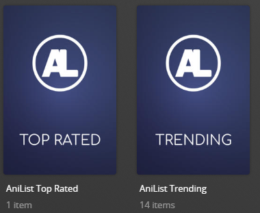

# Anilist Charts Collections

The `anilist` Default Metadata File is used to create collections based on Anilist charts.

**This file works with Movie and TV Libraries.**



## Collections Section 01

| Collection          |    Key     | Description                                          |
|:--------------------|:----------:|:-----------------------------------------------------|
| `AniList Popular`   | `popular`  | Collection of the most Popular Anime on AniList.     |
| `AniList Top Rated` |   `top`    | Collection of the Top Rated Anime on AniList.        |
| `AniList Trending`  | `trending` | Collection of the Trending Anime on AniList.         |
| `AniList Season`    |  `season`  | Collection of the Current Season's Anime on AniList. |

## Config

The below YAML in your config.yml will create the collections:

```yaml
libraries:
  Movies:
    metadata_path:
      - pmm: anilist
  TV Shows:
    metadata_path:
      - pmm: anilist
```

## Template Variables

Template Variables can be used to manipulate the file in various ways to slightly change how it works without having to make your own local copy.

Note that the `templates_variables:` section only needs to be used if you do want to actually change how the defaults work. Any value not specified is its default value if it has one if not it's just ignored.

All [Shared Collection Variables](../variables) are available as well as the additional Variables below which can be used to customize the file.

| Variable                   | Description & Values                                                                                                                                                                                                                                                                                                                                                                                                                                                                                                                         |
|:---------------------------|:---------------------------------------------------------------------------------------------------------------------------------------------------------------------------------------------------------------------------------------------------------------------------------------------------------------------------------------------------------------------------------------------------------------------------------------------------------------------------------------------------------------------------------------------|
| `limit`                    | **Description:** Changes the number of items in a collection for all collections in a Defaults file.<br>**Default:** `100`<br>**Values:** Number greater then 0                                                                                                                                                                                                                                                                                                                                                                              |
| `limit_<<key>>`<sup>1</sup>            | **Description:** Changes the number of items in a collection of the specified key's collection.<br>**Default:** `limit`<br>**Values:** Number greater then 0                                                                                                                                                                                                                                                                                                                                                                                 |
| `collection_order`         | **Description:** Changes the Collection Order for all collections in a Defaults file.<br>**Default:** `custom`<br>**Values:**<table class="clearTable"><tr><td>`release`</td><td>Order Collection by Release Dates</td></tr><tr><td>`alpha`</td><td>Order Collection Alphabetically</td></tr><tr><td>`custom`</td><td>Order Collection Via the Builder Order</td></tr><tr><td>[Any `plex_search` Sort Option](../../metadata/builders/plex.md#sort-options)</td><td>Order Collection by any `plex_search` Sort Option</td></tr></table>      |
| `collection_order_<<key>>`<sup>1</sup> | **Description:** Changes the Collection Order of the specified key's collection.<br>**Default:** `collection_order`<br>**Values:**<table class="clearTable"><tr><td>`release`</td><td>Order Collection by Release Dates</td></tr><tr><td>`alpha`</td><td>Order Collection Alphabetically</td></tr><tr><td>`custom`</td><td>Order Collection Via the Builder Order</td></tr><tr><td>[Any `plex_search` Sort Option](../../metadata/builders/plex.md#sort-options)</td><td>Order Collection by any `plex_search` Sort Option</td></tr></table> |

1. Each default collection has a `key` that when calling to effect a specific collection you must replace `<<key>>` with when calling.

The below is an example config.yml extract with some Template Variables added in to change how the file works.

```yaml
libraries:
  Movies:
    metadata_path:
      - pmm: anilist
        template_variables:
          use_popular: false
          order_top: 01
          summary_top: "Top 10 Rated movies on AniList"
          limit_top: 10
          visible_library_popular: true
          visible_home_popular: true
          visible_shared_popular: true
          sonarr_add_missing: true
          collection_section: 09
          collection_mode: show_items
```
