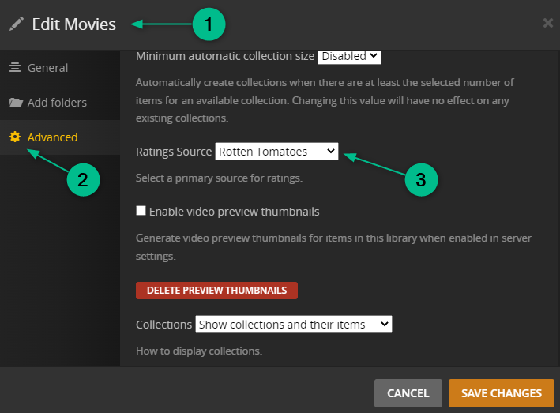
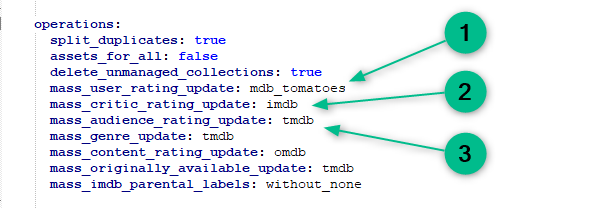
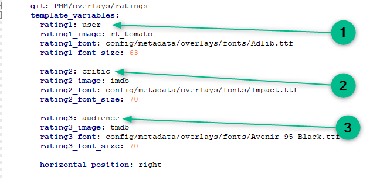

# Collection Defaults

There are many Default Metadata Files built into PMM itself which offer an easy-to-use and customizable set of Collections that the user can achieve without having to worry about creating the files that makes the collections possible.

This is the simplest way to create Collections using Plex Meta Manager.

## Metadata Files

```{include} collections.md
```

## Configurations

To run a default pmm file you can simply add it to your `metadata_path` using `pmm` like so:

```yaml
libraries:
  Movies:
    metadata_path:
      - pmm: actor
      - pmm: genre
```

## Separators

Most Metadata files use separators to denote different sections of collection like actor collections vs studio collections.

**Chart Separator and Award Separator each have their own file, while the other Separators are part of their respective files.**

<details>
  <summary>Click to expand to see an example of Separators.</summary>

   

</details>

### Library On/Off

Chart Separators are turned On by default (except `seasonal`), to turn the Separators On/Off on a per Library basis.

```yaml
libraries:
  LIBRARYNAME:
    template_variables:
      use_separator: false
    metadata_path:
      - pmm: actor
      - pmm: genre
```

## Collection Section Order

All Default Metadata Files have a `collection_section` attribute. These attributes determine the order of the various sections and can be set by [customizing your config](#customizing-configs).

For example: `collection_section: 01` translates to `sort_title: "!<<collection_section>><<pre>><<order_<<key>>>><<sort>>"` and so for `genre` if you have a `Fantasy` collection, plex is going to show `!06_Fantasy`

This is the default PMM collection ordering:

| Collection             | Collection Section |
|:-----------------------|:------------------:|
| `seasonal`             |        `00`        |
| `anilist`              |        `01`        |
| `basic`                |        `01`        |
| `imdb`                 |        `01`        |
| `flixpatrol`           |        `01`        |
| `myanimelist`          |        `01`        |
| `other_chart`          |        `01`        |
| `tautulli`             |        `01`        |
| `tmdb`                 |        `01`        |
| `trakt`                |        `01`        |
| `universe`             |        `02`        |
| `streaming`            |        `03`        |
| `network`              |        `04`        |
| `genre`                |        `06`        |
| `studio`               |        `07`        |
| `country`              |        `09`        |
| `audio_language`       |        `10`        |
| `subtitle_language`    |        `11`        |
| `decade`               |        `12`        |
| `year`                 |        `13`        |
| `content_rating_us`    |        `14`        |
| `content_rating_uk`    |        `14`        |
| `content_rating_cs`    |        `14`        |
| `resolution`           |        `15`        |
| `resolution_standards` |        `15`        |
| `bafta`                |        `16`        |
| `cannes`               |        `16`        |
| `choice`               |        `16`        |
| `emmy`                 |        `16`        |
| `golden`               |        `16`        |
| `oscars`               |        `16`        |
| `other_award`          |        `16`        |  
| `spirit`               |        `16`        |
| `sundance`             |        `16`        |
| `actor`                |        `17`        |
| `director`             |        `18`        |
| `producer`             |        `19`        |
| `writer`               |        `20`        |

## Rating Overlays

By default for Movies in Plex, the `Ratings Source` dropdown (`#3`) below, can come from Rotten Tomatoes (and includes Critic Ratings and Audience Ratings) or IMDb (Audience Ratings). This only changes the tiny icons displayed and where Plex will retrieve the ratings from upon initial scan and import of the media metadata.

**Plex Meta Manager can insert up to three ratings of your choice into the three spots regardless of what you choose in the `Advanced` tab of that Plex library**



Plex has three available spots in the Plex DB to store ratings and thus Plex Meta Manager can be used to insert ratings sources of your choice into those spots. They are known as the User Rating (`#1`), Critic Rating (`#2`), and Audience Rating (`#3`). 

**Note that the little icons cannot be changed and that the numbers next to the little icons are reflected in the poster ratings overlay**


To be able to insert the ratings you want, Plex Meta Manager operations need to be defined. In this example below, User ratings (`#1`) are being filled with Rotten Tomatoes Critics Ratings. Critic ratings (`#2`) are filled with IMDb, and Audience ratings (`#3`) are filled with TMDb.

**mass_*_rating_update** sources can be found here: [operations](../../config/operations)



Finally, to show the ratings on the poster, the following was added to the `overlay_path` section in the `config.yml` file to post Rotten Tomatoes Critics Ratings in (`#1`), IMDb ratings in (`#2`), and TMDb ratings in (`#3`)




## Customizing Configs

Configs can be customized using the `template_variables` attribute when calling the file. These `template_variables` will be given to every template call in the file which allows them to affect how that file runs.

This example changes the ratings overlay to work on episodes.

```yaml
libraries:
  TV Shows:
    overlay_path:
    - pmm: ratings
      template_variables:
        overlay_level: episode
```

Each file has a comment block at the top showing the available `template_variables` for each file. For example the [`pmm: genre`](https://github.com/meisnate12/Plex-Meta-Manager-Configs/blob/master/PMM/genre.yml) has this:

```yaml
#############################################################
#                 Dynamic Genre Collections                 #
#         Created by Yozora, Bullmoose20, & Sohjiro         #
#############################################################
#  Call this from your config.yml (Movie or Show)           #
#  If nothing is specified these are the defaults           #
#                                                           #
#    metadata_path:                                         #
#      - pmm: genre                                     #
#        template_variables:                                #
#          # Turn the [Separator Collection](../separators) on/off           #
#          use_separator: true                              #
#          # Sets how the collection is sorted              #
#          sort_by: release.desc                            #
#          # Sets the collection mode of the collection     #
#          collection_mode:                                 #
#          # Sets the value at the start of the sort title  #
#          collection_section: "06"                         #
#############################################################
```
 
Each of these when passed will change how the collection runs slightly. 
* `use_separator` Turn the [Separator Collection](../separators) on/off
* `sort_by` Sets how the collection is sorted
* `collection_mode` Sets the collection mode of the collection 
* `collection_section` Sets the value at the start of the sort title

**In addition to the defined `template_variables` each file in the PMM Folder has access to the `radarr_add_missing` and `sonarr_add_missing` template variables and for dynamic collections most attributes can be passed as template variables**

For example if you want yearly oscar collections that go back 10 years instead of 5 all of which gets sent to radarr use the `data` and `radarr_add_missing` template variables.

```yaml
libraries:
  Movies:
    metadata_path:
    - pmm: oscars
      template_variables:
        radarr_add_missing: true
        data:
          starting: current_year-10
          ending: current_year
```

Or maybe you want to change the number of actor collections made using pmm: actor.

```yaml
libraries:
  Movies:
    overlay_path:
    - pmm: actor
      template_variables:
        collection_mode: hide
        data:
          depth: 5
          limit: 50
```

Or maybe you want to change the collection sort order of the genre collections using pmm: genre.

```yaml
libraries:
  Movies:
    metadata_path:
    - pmm: genre
      template_variables:
        collection_section: 11
```

Or maybe you want to disable separators globally per library.

```yaml
libraries:
  LIBRARYNAME:
    template_variables:
      use_separator: false
    metadata_path:
```

Alternatively it can be turned off individually per git file:

```yaml
libraries:
  LIBRARYNAME:
    metadata_path:
      - pmm: <file1>    # separator is disabled
        template_variables:
          use_separator: false
      - pmm: <file2>    # separator is enabled by default
      - pmm: <file3>    # separator is disabled
        template_variables:
          use_separator: false
```

## Errors

If there are collections being made that have configuration errors or missing posters please either bring it up in our Discord or raise an Issue on the [Configs Repo](https://github.com/meisnate12/Plex-Meta-Manager-Configs/issues/new/choose). 

```{include} example.md
```