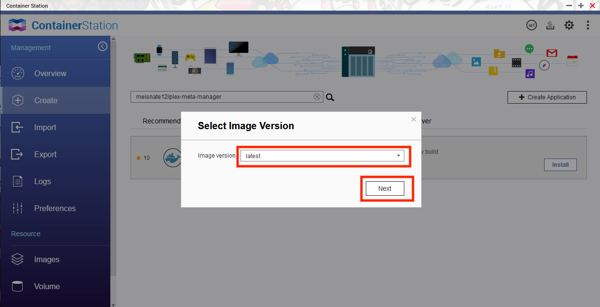
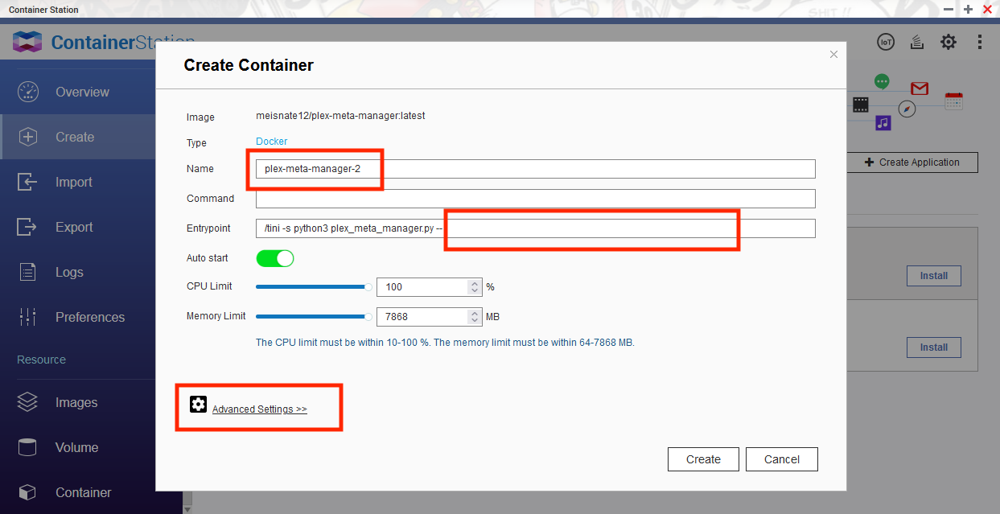

# QNAP Walkthrough

This is a quick walkthrough of setting up the Plex-Meta-Manager Docker container in the QNAP "Container Station" UI.

The "Container Station" UI on your QNAP may differ from these screenshots, but the concepts are the same:

1. Create a container based on the `meisnate12/plex-meta-manager` image.
2. Set environment variables to control the container's behavior [optional].
3. Point the container to the directory where your configuration files are to be stored.

Detailed steaps:

1. Open Container Station; click "Create" in the left column.

   

2. Search for `meisnate12/plex-meta-manager`.

   On the "Docker Hub" tab you should see the image; click on it and click "Install".

   

1. Select the version you want to run from the dropdown and click "Next".

   The options are:
    - `latest`: most recent official release; typically the most stable
    - `develop`: development release, contains new features that haven't made it to latest yet, but may have minor problems
    - `nightly`: bleeding-edge development version; latest fixes go here, but breakage should be expected.

   

2. Change the container name if you wish.

   Command line arguments can be entered in the "Entrypoint" field after `/tini -s python3 plex_meta_manager.py --`  

   IMPORTANT: **DO NOT REMOVE** ANY ELEMENT OF THAT TEXT.  DO NOT ENTER ANYTHING INTO THE "Command" FIELD.

   For example, you could enter the following into the "Entrypoint" field to make PMM run immediately when the container starts up: `/tini -s python3 plex_meta_manager.py -- --run`

   Typically, in a Docker environment, this sort of thing is done via Environment Variables [the next step here].  Editing the "Entrypoint" is not recommended, as it's easy to render the container non-functional if you are not sure what you're doing.

   Information on available command line arguments can be found [here](../environmental)

   Click "Advanced Settings >>"

   

3. Environment Variables can be added here:

   Anything you can do via command-line arguments can be done with Environment Variables, which is more typical in Docker environments.

   For example, you could add an environment variable named `PMM_RUN` with a value of `True` to make PMM run immediately when the container starts up.

   Information on available Environment Variables can be found [here](../environmental)

   

4. Click Shared Folders Tab:

   Click "Add" in the middle section "Volume from host".

   "Volume from host" is the location on your QNAP where you want to store the config files.

   "Mount Point" must be `/config`

   When finished, click "Create".

   

