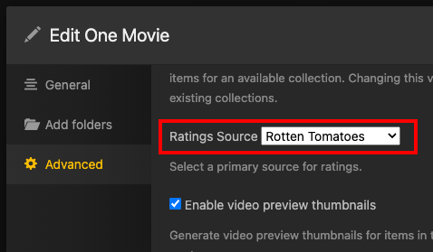
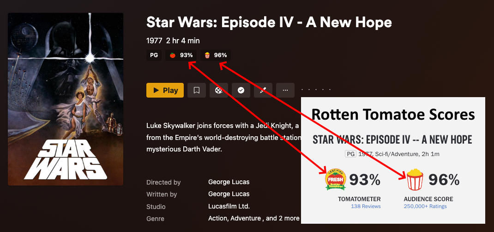
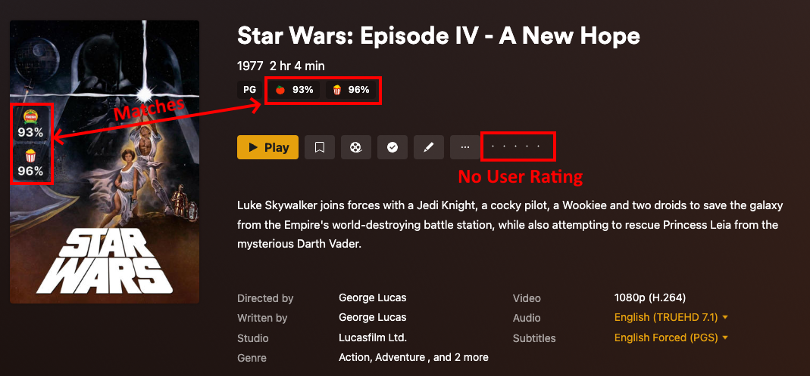
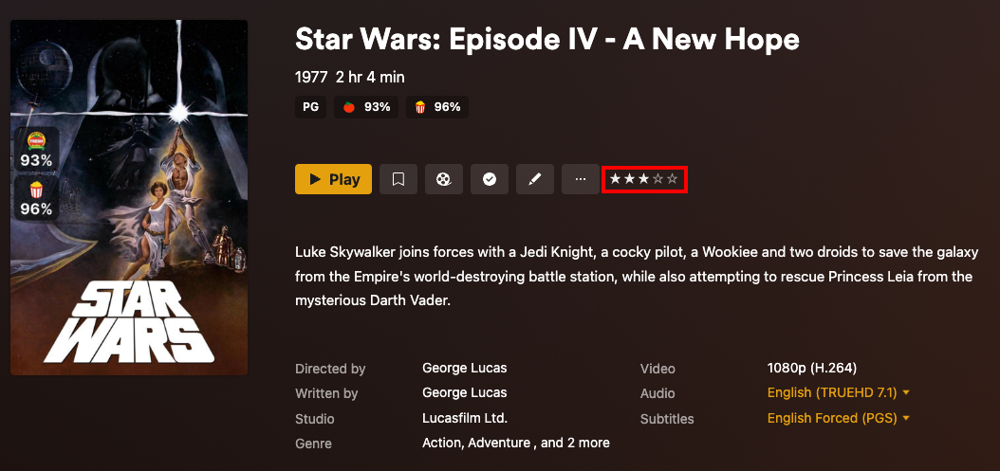
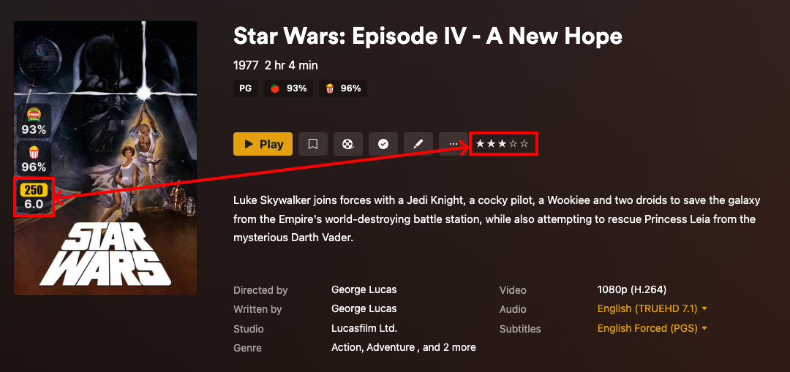
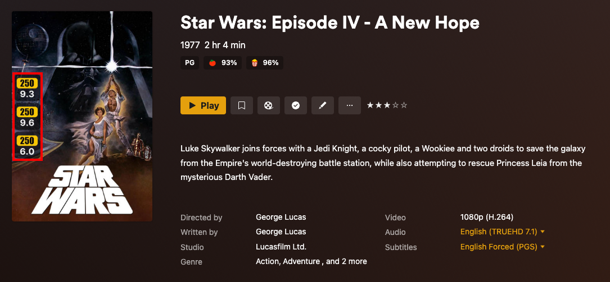
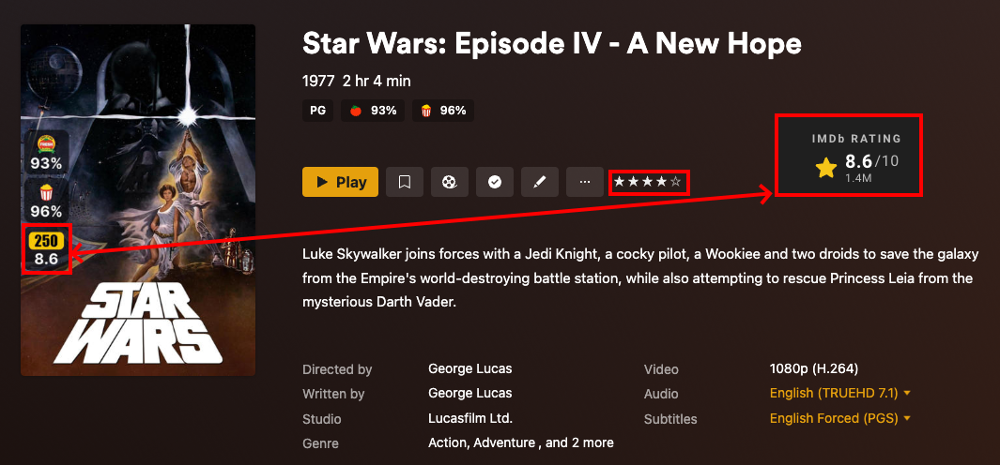
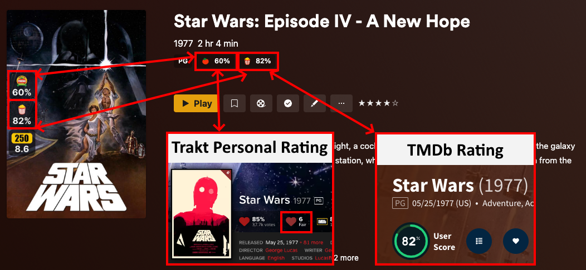
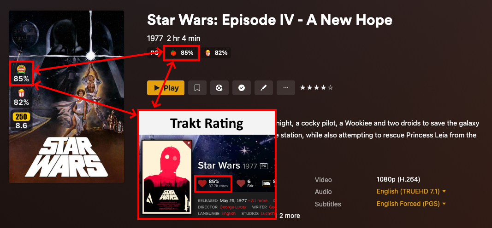
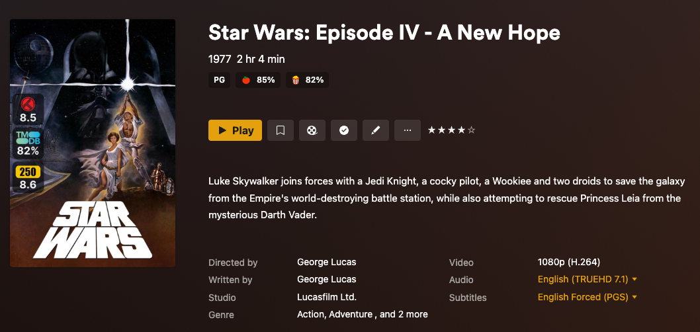

# PMM Ratings Explained

How do ratings and ratings overlays work in PMM? This Guide will walk through some basics of how ratings work in conjunction with Plex Meta Manager.

<h4>Basics</h4>

Each thing in Plex that can have a rating [movie, show, episode, album, track] has three ratings "boxes" or "fields".  Critic, Audience, and User.

The Critic and Audience ratings are typically managed by Plex, pulling from whatever you specify as the ratings source for the library; this is what determines the images that are displayed in the Plex UI.  The User rating is the star rating assigned by you to the item.

PMM can insert a broader range of values into those fields than Plex supports natively, then it can leverage those values in overlays and the like.

It's doing this "behind Plex's back", so there can be some seeming inconsistencies in the way things are displayed in the UI.  This guide is intended to clear up some of these things.

<h4>Setup</h4>

Here's our starting point if you want to run through this yourself:

Set up a brand new Library with only one movie in it. Ensure the Ratings source on the library is set to Rotten Tomatoes:

   

The Plex UI shows the correct ratings and icons for Rotten Tomatoes and is aligned with the Rotten Tomatoes site:

   

Also note that we have not given this a user rating.

<h4>Initial Overlay</h4>

Now let's add rating overlays to the poster. We're going to use the minimal config needed here to illustrate the concepts.

<details>
  <summary>Click to see initial minimal config</summary>

```yaml
libraries:
  One Movie:
    overlay_path:
    - reapply_overlays: true
    - pmm: ratings
      template_variables:
        rating1: critic
        rating1_image: rt_tomato
        rating2: audience
        rating2_image: rt_popcorn
        rating3: user
        rating3_image: imdb
```

* `rating1`, `rating1_image`, `rating2`, `rating2_image` are set to match the ratings that Plex already has assigned to those fields (critic/audience).  The order here is arbitrary.
* `rating3` is set to be the user rating and it's image (`rating3_image`) is set to IMDb just because we have to pick something.
* `reapply_overlays` is set to true to ensure that PMM always updates the overlays as we run things.

</details>

After PMM is run on this library, you'll get this result:

   

* PMM has added those two ratings to the poster using the values already stored with the movie. The icons and values are correctly associated simply because we made sure they are in the config file.
* The two ratings match, and there is no IMDb rating icon on the poster since there is no user rating. (no star rating on the right)

Now we're going to add a user rating by clicking the middle star on the right for a rating of 3/5:

   

Now just run PMM again without changing anything else and the user rating overlay will appear:

   

* PMM added the third rating overlay, since there is now a value in the user rating. 
* It gave it an IMDb icon because we told it to in the config file. ([Why does it say 250 instead of IMDb?](#why-do-different-images-appear-for-the-same-source))
* It's displaying 6.0 since 3 stars on a 5-star scale is 60%.

<h4>Change Rating Image</h4>

You and I both know that the IMDb rating isn't 6.0, but PMM is just doing what it's told. Nobody but us humans know where those numbers come from. As an example, let's change the icons to "prove" that PMM doesn't know or care:

<details>
  <summary>Click to see the updated config</summary>

```yaml
libraries:
  One Movie:
    overlay_path:
    - reapply_overlays: true
    - pmm: ratings
      template_variables:
        rating1: critic
        rating1_image: imdb
        rating2: audience
        rating2_image: imdb
        rating3: user
        rating3_image: imdb
```

* `rating1_image` and `rating2_image` were both changed from `rt_score` and `rt_popcorn` respectively to `imdb`

</details>

When the above is run you see this result:

   

* Three different ratings on the poster, all IMDb; All while the Plex UI still shows RT icons.
* Note that the existing RT ratings numbers (`93%` and `96%`) display on the poster as `9.3` and `9.6`. This is happening because we just told PMM that those ratings were IMDb, and IMDb ratings are on a 1-10 scale. PMM doesn't "know" where those numbers are from, it just does what it's told to do and places the value (critic/audience/user) in that rating box. 
* That first overlay showing an IMDb rating of `9.3` is not evidence that PMM pulled the wrong IMDb rating; it just shows that it has been told to display the number in the critic rating box (whatever that number is) as an IMDb rating. All three of those overlays mean the same thing; PMM read a number from a field and stuck it on the poster formatted as requested.

<h4>Update User Ratings</h4>

Now let's actually update the ratings and push some numbers into those boxes using library operations  We'll start with making that user rating accurate:

<details>
  <summary>Click to see the updated config</summary>

```yaml
libraries:
  One Movie:
    overlay_path:
    - reapply_overlays: true
    - pmm: ratings
      template_variables:
        rating1: critic
        rating1_image: rt_tomato
        rating2: audience
        rating2_image: rt_popcorn
        rating3: user
        rating3_image: imdb
    operations:
      mass_user_rating_update: imdb
```

* `operations` with the attribute `mass_user_rating_update` set to `imdb` is added.
* `rating1_image` and `rating2_image` were both changed back to `rt_score` and `rt_popcorn` respectively from `imdb`

</details>

This will put the actual IMDb rating value, retrieved from IMDb, into the "user" rating field.

After that has been run, we see:

   

* The IMDb Rating Overlay on the poster matches the rating from the IMDb page for Star Wars.
* The number of stars has also changed to 4 stars. (since `8.6` split in half is `4.3` and then rounded down to the nearest half gives you 4 stars)

<h4>Update Critic & Audience Ratings</h4>

Now let's update the critic and audience ratings to some different ratings:

<details>
  <summary>Click to see the updated config</summary>

```yaml
libraries:
  One Movie:
    overlay_path:
    - reapply_overlays: true
    - pmm: ratings
      template_variables:
        rating1: critic
        rating1_image: rt_tomato
        rating2: audience
        rating2_image: rt_popcorn
        rating3: user
        rating3_image: imdb
    operations:
      mass_critic_rating_update: trakt_user
      mass_audience_rating_update: tmdb
      mass_user_rating_update: imdb
```

* under `operations` the attribute `mass_critic_rating_update` set to `trakt_user` and `mass_audience_rating_update` set to `tmdb` are added.

</details>

Running the above will put the Trakt User's personal rating into the critic box and the TMDb rating into the audience box. Note that we haven't changed the rating images yet.

   

* Critic rating matches the trakt personal user rating of `6` which is displayed as `60%`:
* Audience rating matches the TMDb rating of `82%`.
* Note how the values have changed dramatically and all match between the overlay, plex ratings, and external sites.

The log will show PMM updating those values.

```
| Processing: 1/1 Star Wars: Episode IV - A New Hope     |
| Batch Edits                                            |
| Audience Rating | 8.2                                  |
| Critic Rating | 6.0                                    |
```

* And the poster reflects those numbers, though with the wrong icons, since that's what **PMM has been told to do**.
* The Plex UI still shows RT icons, and it always will, even though the numbers displayed are no longer RT ratings.  Plex has no idea.

<h4>Use Trakt Rating</h4>

Let's change the Trakt rating to that trakt public rating of 85% instead, which is available via mdblist:

<details>
  <summary>Click to see the updated config</summary>

```yaml
libraries:
  One Movie:
    overlay_path:
    - reapply_overlays: true
    - pmm: ratings
      template_variables:
        rating1: critic
        rating1_image: rt_tomato
        rating2: audience
        rating2_image: rt_popcorn
        rating3: user
        rating3_image: imdb
    operations:
      mass_critic_rating_update: mdb_trakt
      mass_audience_rating_update: tmdb
      mass_user_rating_update: imdb
```

* under `operations` the attribute `mass_critic_rating_update` was changed to `mdb_trakt` from `trakt_user`. (This step requires MDBList to be configured)

</details>

When the above is run you should get:

   

* Note how the `60%` in `rating1` became `80%`

<h4>Use Proper Images</h4>

Now, finally, let's make the poster rating images match the numbers we put in there:

<details>
  <summary>Click to see the updated config</summary>

```yaml
libraries:
  One Movie:
    overlay_path:
    - reapply_overlays: true
    - pmm: ratings
      template_variables:
        rating1: critic
        rating1_image: trakt
        rating2: audience
        rating2_image: tmdb
        rating3: user
        rating3_image: imdb
    operations:
      mass_critic_rating_update: mdb_trakt
      mass_audience_rating_update: tmdb
      mass_user_rating_update: imdb
```

* `rating1_image` was changed to `trakt` from `rt_score`
* `rating2_image` was changed to `tmdb` from `rt_popcorn`

</details>

When the above is run you should get:

   

This config file is the **only linkage** between the ratings we are setting and the icons we want displayed, as we've seen above.

You can see that the Plex UI still shows the RT icons with the Trakt and TMDb numbers we put into the relevant fields, since again, it has no idea those numbers got changed behind its back.

The poster displays the correct icons because we told PMM to do so in the config file.

## Why do different Images appear for the same source?

As seen in the Images above the IMDb rating image says `250` instead of `IMDb` and the Rotten Tomatoes rating images has the certified fresh logo vs their normal logo.

This is because the Star Wars: Episode IV - A New Hope is in the IMDb Top 250 list as well as being Certified Fresh by Rotten Tomatoes and that gets reflected by the rating image.


